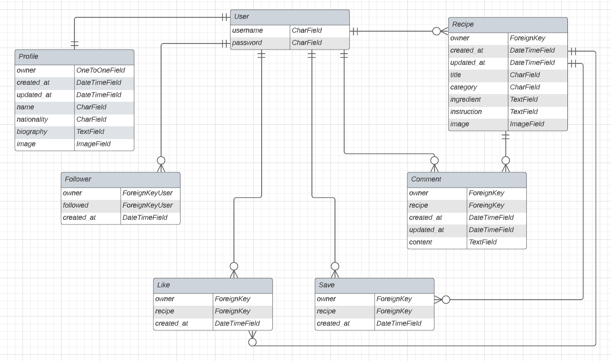

# Potato API

This is the API built for the recipe sharing website [Potato](https://potato.herokuapp.com/).
Link to live API site [Potato API](https://drf-api-potato.herokuapp.com/)

## Table of contents
1. [USER STORIES](#user-stories)

2. [PLANNING](#planning)
    - [ERD](#erd)

3. [DATABASE](#database)
    - [Models](#models)

4. [USED TECHNOLOGY](#used-technology)
    - [Languages](#languages)
    - [Libraries & Tools](#libraries-tools)
    - [Frameworks](#frameworks)

5. [DEPLOYMENT](#deployment)

6. [TESTING](#testing)
    - [Manual Testing](#manual-testing)

7. [CREDITS](#credits)
## User Stories

### These are the user stories I used to guide myself when building the database: 

**User**
- Create users: As a **Site admin** I can **create superusers** so that **I can manage user features**

**Profile**
- Manage user profiles: As a **Site admin** I can **create, read and update user profiles** so that **I can manage user profiles**
- View profile details: As a **Site admin** I can **view a list of user profiles** so that **I can display details of user profiles**

**Recipe**
- Manage user recipes: As a **Site admin** I can **create, read, update and delete user recipes** so that **I can share recipes with other user profiles**
- View recipe details: As a **Site admin** I can **view a list of user recipes** so that **I can display details of user recipes**

**Comment**
- Manage user comments: As a **Site admin** I can **create, read, update and delete comments** so that **I can comment on recipes of other user profiles**
- View comment details: As a **Site admin** I can **view a list of user comments** so that **I can display details of user comments**

**Like**
- Manage user likes: As a **Site admin** I can **create, read and delete user likes** so that **I can like or unlike other profiles recipes** 
- View like details: As a **Site admin** I can **view a list of user likes** so that **I can display details of which user liked what, of other profiles recipes**

**Save**
- Manage user saves: As a **Site admin** I can **create, read and delete user saves** so that **I can save or unsave other profiles recipes** 
- View save details: As a **Site admin** I can **view a list of user saves** so that **I can display details of which user saved what, of other profiles recipes** 

**Follower**
- Manage user follows: As a **Site admin** I can **create, read and delete user follows** so that **I can follow or unfollow other profiles** 
- View follow details: As a **Site admin** I can **view a list of user follows** so that **I can display details of each profiles followers and following**

## Planning

### ERD

During the planning phase I created an entity relationship diagram (ERD), to make a clearer picture of the connection between the database models. I used an ERD tool provided by [Lucidchart](https://www.lucidchart.com/pages/er-diagrams). Below is an image of the ERD: 

## Database

### Models

**Profiles**

Fields in the Profile model:

- Owner, One-to-one field connected to User
- Created_at, Date-time field set with auto-now-add as true
- Updated_at, Date-time field set with auto-now as true
- Name, Char field with a max length of 255 characters, set with blank as true
- Nationality, Char field with a max length of 255 characters, set with blank as true
- Biography, Text field with a max length of 255 characters, set with blank as true
- Profile_img, Image field set with a default URL, linked at Cloudinary

**Comments**

Fields in the Comments model:

- Owner, set with foreign-key connected to User
- Recipe, set with foreign-key connected to Recipe
- Created_at, Date-time field set with auto-now-add as true
- Updated_at, Date-time field set with auto-now-add as true
- Content, Text field

**Followers**

Fields in the Followers model:

- Owner, set with foreign-key connected to User with a related name of “following”
- Followed, set with foreign-key connected to User with a related name of “followed”
- Created_at, Date-time field set with auto-now-add as true

**Likes**

Fields in the Likes model:

- Owner, set with foreign-key connected to User
- Recipe, set with foreign-key connected to Recipe with a related name of “likes”
- Created_at, Date-time field set with auto-now-add as true

**Saves**

Fields in the Saves model:

- Owner, set with foreign-key connected to User
- Recipe, set with foreign-key connected to Recipe with a related name of “saves”
- Created_at, Date-time field set with auto-now-add as true

**Recipes**

Fields in the Recipes model:

- Owner, set with foreign-key connected to User
- Created_at, Date-time field set with auto-now-add as true
- Updated_at, Date-time field set with auto-now as true
- Title, Char field with a max length of 255 characters
- Category, Char field with a max length of 50 characters, choices based on CATEGORY_CHOICES
- Ingredient, Text field, set with blank as true
- Instruction, Text field, set with blank as true
- Image, Image field set with a default URL, linked at Cloudinary

## Used technologies

### Languages
- Python

### Frameworks 
- Django REST Framework was used to build the back-end API

### Libraries & Tools
- Cloudinary to store static image files
- Git was used for version control via Gitpod terminal to push the code to GitHub
- GitHub was used as a remote repository to store project code
- Django AllAuth was used for user authentication
- Psycopg2 was used as a PostgreSQL database adapter for Python
- PostgreSQL – deployed project on ElephantSQL uses a PostgreSQL database

## Deployment
 
**This project was deployed through Heroku using the following steps:**

**Creating Heroku App**
+ Log into Heroku
+ Select 'Create New App' from your dashboard
+ Choose an app name (if there has been an app made with that name, you will be informed and will need to choose an alternative)
+ Select the appropriate region based on your location
+ Click 'Create App'

**Connecting to GitHub**
+ From the dashboard, click the 'Deploy' tab towards the top of the screen
+ From here, locate 'Deployment Method' and choose 'GitHub'
+ From the search bar newly appeared, locate your repository by name
+ When you have located the correct repository, click 'Connect'

**Environment Variables**
+ Click the 'Settings' tab towards the top of the page
+ Locate the 'Config Vars' and click 'Reveal Config Vars'
+ Add the variables needed

## Testing

### Manual testing

- I have tested that this API works as intended in browsers Chrome and Firefox.
- I have tested that all features are being correctly displayed according to their specific urls and that data entries are being properly registered. 

## CREDITS

**Code Institute: DRF API walkthrough**
- As part of the course material, a guided walkthrough of creating an API with DRF [Link](https://learn.codeinstitute.net/courses/course-v1:CodeInstitute+DRF+2021_T1/courseware/f775d54df4da44d18309888b3fe884f7/bc5fbada70104d489aa0363a03d8bda8/)

**DRF docs**
- Official DRF docs [Link](https://www.django-rest-framework.org/)

**Recipe model - Category options**
- For the code snippet regarding recipe models category choices [Link](https://blog.devgenius.io/django-tutorial-on-how-to-create-a-booking-system-for-a-health-clinic-9b1920fc2b78)

**Vilma Thuresson**
- For the README.md structure and Heroku deployment process, taken from the README.md file of this repository, [Vilma Thuressons repository](https://github.com/VilmaTuresson/test-hub-API/blob/main/README.md)